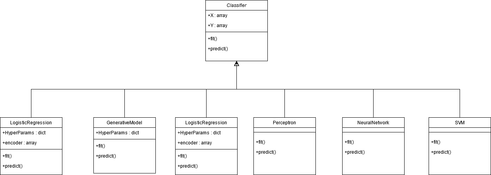

# Project
Kaggle Challenge: Leaf Classification

The objective of this project is to use binary leaf images and extracted features, including shape, margin & texture, to accurately identify 99 species of plants.
We are using six classifiers that uses the provided pre-extracted features to learn, and try to examine the errors what we can do to improve in terms of cross-validation implementation and search of the best hyperparameters.
## Data Description

The dataset consists approximately 1,584 images of leaf specimens (16 samples each of 99 species) which have been converted to binary black leaves against white backgrounds. Three sets of features are also provided per image: a shape contiguous descriptor, an interior texture histogram, and a fine-scale margin histogram. For each feature, a 64-attribute vector is given per leaf sample.

Note that of the original 100 species, we have eliminated one on account of incomplete associated data in the original dataset.

REF : https://www.kaggle.com/c/leaf-classification/data

## File descriptions

- train.csv - the training set
- test.csv - the test set
- sample_submission.csv - a sample submission file in the correct format
- images - the image files (each image is named with its corresponding id)

## Data fields

- id - an anonymous id unique to an image
- margin_1, margin_2, margin_3, ..., margin_64 - each of the 64 attribute vectors for the margin feature
- shape_1, shape_2, shape_3, ..., shape_64 - each of the 64 attribute vectors for the shape feature
- texture_1, texture_2, texture_3, ..., texture_64 - each of the 64 attribute vectors for the texture feature
## Classifiers class design :



### Installing dependencies 

To run the code, certain python libraries must be installed. We recommend creating a virtual
python environment. Once the virtual environment is created, activate it and the necessary packages can be installed with:
```
pip install -r requirements.txt
```

### Unpack Datasets

To unpack dataset, run from root folder:
```bash
python3 ./dataset/leaf-classification.py
```

### Verify and Run

To verify that the setup is complete, navigate to the project root folder and type in a terminal window:
```bash
python -m src.Manager
```
After the verification is done, you can run the code using the following command from the project root folder:
```bash
python main.py
```
You can then find the results in /results/results.json

### Notebook
The project notebook is found in /notebooks called `KAGGLE-CHALLENGE-NOTEBOOK.ipynb`. In this notebook you can see data exploration and analysis and also visualise all GridResearch results. 

